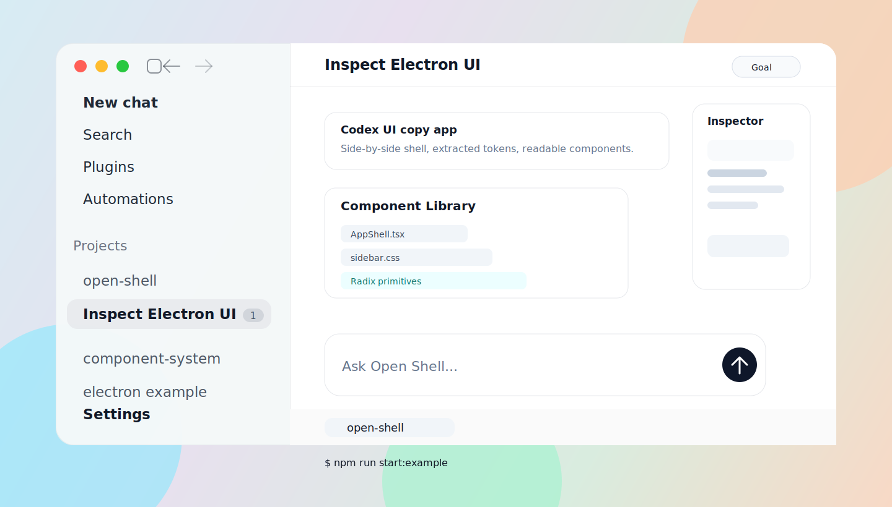
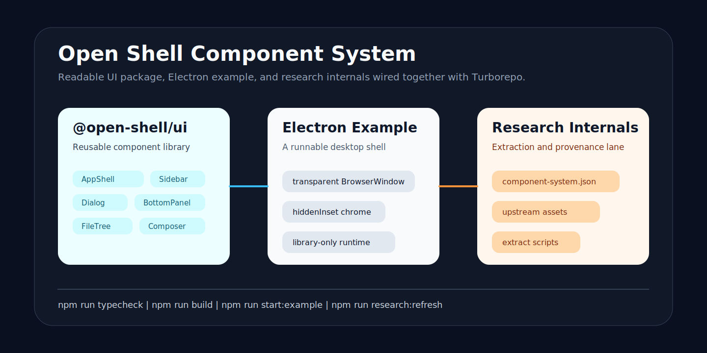

# Open Shell UI

[](#status)
[](./apps/docs)
[](https://turbo.build/repo)
[](./apps/docs)
[](https://react.dev)
[](https://www.radix-ui.com)
[](./examples/electron-shell)
[](https://www.typescriptlang.org)
[](./LICENSE)
[](./CONTRIBUTING.md)

Open Shell UI is a React component system for building agent-native software: translucent desktop shells, dense sidebars, shared back/forward history, settings surfaces, persistent slot tabs, terminals, file trees, review panes, command menus, chat surfaces, and high-context composers.

It is the UI engine layer you want before you start writing product logic. Instead of another dashboard kit, it gives teams the primitives and shell grammar for modern agent workspaces.



## What Changed

This repository is now organized like a serious component-library project:

- `@open-shell/ui` is the public React package.
- `apps/docs` is a Next/Fumadocs documentation site with live component previews.
- `examples/electron-shell` is the runnable Electron app that consumes the package.
- `research/codex-internals` remains the private research/provenance workspace for continuing component-system reconstruction.

Current release: `0.3.0`.

## Quick Start

```sh
npm install
npm run docs:dev
```

Open the docs at `http://localhost:3001`.

```tsx
import "@open-shell/ui/styles.css";
import {
  AppShell,
  BottomPanel,
  Composer,
  FileTree,
  Sidebar,
  TerminalSurface,
  ThreadSurface,
  useShellHistory,
} from "@open-shell/ui";

export function AgentWorkspace() {
  const history = useShellHistory([
    { id: "thread:launch-review", type: "thread", title: "Launch review" },
  ]);

  return (
    <AppShell
      history={history}
      sidebar={<Sidebar items={[]} projects={projects} />}
      main={<ThreadSurface title="Launch review" messages={messages} />}
      composer={<Composer placeholder="Ask the agent to inspect this codebase..." />}
      rightPanel={<FileTree items={files} />}
      bottomPanel={
        <BottomPanel
          tabs={[
            {
              active: true,
              id: "terminal",
              title: "open-shell",
              content: <TerminalSurface cwd="~/open-shell">npm run docs:dev</TerminalSurface>,
            },
          ]}
        />
      }
    />
  );
}
```

## Install From npm

`@open-shell/ui` now builds as a normal npm package:

```sh
npm install @open-shell/ui react react-dom
```

Then import the package and stylesheet:

```tsx
import { AppShell, Sidebar, useShellHistory } from "@open-shell/ui";
import "@open-shell/ui/styles.css";
```

## Install Into Another Project

No publish step is required. The installer copies the component source into the target app, shadcn-style, so the receiving project owns the files.

From this repo:

```sh
npm run install:ui -- --target ../my-agent-app
```

From GitHub raw:

```sh
curl -fsSL https://raw.githubusercontent.com/AbhinavMishra32/open-shell/main/scripts/install-open-shell-ui.mjs | node - --target .
```

Useful options:

```sh
node scripts/install-open-shell-ui.mjs \
  --target ../my-agent-app \
  --out-dir src/components/ui/open-shell \
  --force
```

What it does:

- copies `packages/ui/src` into the target project
- writes an `INSTALL.md` beside the copied components
- installs missing Radix dependencies unless `--skip-install` is passed
- keeps React/React DOM as target-app responsibilities

## Monorepo

| Workspace | Path | Purpose |
| --- | --- | --- |
| `@open-shell/docs` | `apps/docs` | Documentation site, component registry, guides, and live previews. |
| `@open-shell/ui` | `packages/ui` | Reusable React components, CSS tokens, and Radix-backed primitives. |
| `@open-shell/electron-example` | `examples/electron-shell` | Desktop example app consuming the component package. |
| Research internals | `research/codex-internals` | Extraction scripts, inventories, and implementation notes. |



## Components

| Component | Category | Notes |
| --- | --- | --- |
| `AppShell` | Shell | Sidebar, topbar, main, composer, right panel, and bottom panel slots. |
| `useShellHistory` | Navigation | Shared back/forward stack for threads, files, settings, routes, and slot tabs. |
| `Sidebar` | Navigation | Project/thread navigation, primary actions, footer controls. |
| `SettingsSidebar` | Navigation | Settings sidebar with search, grouped sections, back-to-app control, and active rows. |
| `SettingsPanel` | Shell | Settings main surface with sections, cards, rows, toggles, selects, and option cards. |
| `Composer` | Input | Attachment menu, permission control, model/reasoning menu, submit. |
| `SlotPanel` | Shell | Generic tab system for any slot, with controlled active state and mounted inactive tabs. |
| `BottomPanel` | Shell | Resizable Radix Tabs panel for terminal, files, side chat, logs. |
| `TerminalSurface` | Data | Monospace process/log surface for bottom-panel slots. |
| `FileTree` | Data | Searchable file tree with icon, git, and action lanes. |
| `FileBrowserPanel` | Data | Code viewport plus right-side file tree composition. |
| `ThreadSurface` | Shell | Conversation surface with activity rows and run cards. |
| `Dialog` | Overlay | Radix Dialog wrapper with size tokens and measured content height. |
| `DropdownMenu` | Overlay | Radix Dropdown Menu wrapper for compact command menus. |
| `ContextMenu` | Overlay | Radix Context Menu wrapper for thread/file/editor surfaces. |
| `Button` | Primitive | Button, icon button, pill, and status dot primitives. |

Every component has a docs page with:

- live preview
- import example
- slot anatomy
- prop table
- source path
- related components

## Docs

```sh
npm run docs:dev
npm run docs:build
```

The docs app uses a Next + Fumadocs shell and renders the real package exports. This keeps the docs honest: if a component breaks, the docs break too.

Key docs:

- `apps/docs/app/docs/installation/page.tsx`
- `apps/docs/app/docs/architecture/page.tsx`
- `apps/docs/app/docs/slots/page.tsx`
- `apps/docs/app/docs/theming/page.tsx`
- `apps/docs/app/docs/components/[slug]/page.tsx`

## Electron Example

```sh
npm run start:example
```

The Electron example demonstrates:

- transparent macOS window surface
- hidden inset titlebar
- translucent sidebar material
- Codex-style sidebar collapse, back, and forward controls connected to shared shell history
- settings sidebar/main-mode switching using reusable settings primitives
- chat thread canvas
- composer dock
- inspector/file-tree side rail
- resizable bottom terminal panel with mounted inactive tabs so terminal state survives tab switches

## Shell Slots

`AppShell` is built around named slots:

```ts
type AppShellSlots = {
  sidebar: React.ReactNode;
  main: React.ReactNode;
  composer: React.ReactNode;
  rightPanel?: React.ReactNode;
  bottomPanel?: React.ReactNode;
};
```

That slot contract is the center of the system. The layout, animation, and density are coordinated at shell level so downstream apps can focus on data and workflow logic.

## Shared History

Use `useShellHistory` when any surface in the app should participate in one back/forward stack:

```tsx
const history = useShellHistory([
  { id: "thread:home", type: "thread", title: "Home" },
]);

history.push({
  id: "file:package.json",
  type: "file",
  title: "package.json",
  payload: { path: "package.json" },
});

<AppShell history={history} sidebar={<Sidebar projects={projects} />} main={<CurrentSurface />} />;
```

The default sidebar chrome uses that controller for Codex-style back and forward buttons. `SlotPanel` and `BottomPanel` expose `activeTabId`, `onActiveTabChange`, tab lifecycle callbacks, and `keepMounted` so terminal/process surfaces do not reset when another tab becomes active.

## Commands

```sh
npm run docs:dev       # run the documentation site
npm run docs:build     # build docs
npm run start:example  # run Electron example
npm run typecheck      # typecheck all workspaces
npm run build          # build all workspaces
npm run research:refresh
```

## Status

Alpha. The public package is usable, but the component system is intentionally evolving as more shell patterns are ported into readable, documented components.

## License

MIT. See [LICENSE](./LICENSE).
